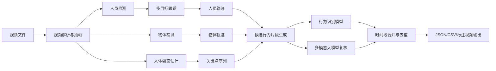

# 视频人员行为分析课题方案

## 1. 课题背景

随着安防监控、智慧办公、工业生产、养老看护和公共空间管理等场景中视频数据规模持续增长，仅依靠人工查看视频已经难以满足实时性、准确性和可追溯性要求。本课题拟研究一种面向视频文件的人员行为分析方法，对视频中的多名人员进行检测、跟踪和行为识别，并输出每个人在不同时间段内执行的具体行为。

典型目标包括：

- 人员 1 在 `00:01:12-00:01:18` 喝水。
- 人员 2 在 `00:02:03-00:02:26` 使用打印机。
- 人员 3 在 `00:04:10-00:04:45` 打电话。

该任务不仅需要判断“视频中发生了什么”，还需要回答“谁在什么时间做了什么”。因此，本课题属于多目标跟踪、时空行为识别、时间动作定位和人-物交互理解的综合问题。

## 2. 研究目标

本课题的总体目标是构建一个视频人员行为分析系统，输入一段视频文件，输出结构化的人员行为时间轴。

### 2.1 功能目标

系统应支持以下能力：

1. 读取本地视频文件，解析帧率、总时长和时间戳。
2. 检测视频中的人员，并为每名人员分配稳定的跟踪 ID。
3. 检测与行为相关的物体，例如水杯、水瓶、打印机、手机等。
4. 识别人员行为，例如喝水、使用打印机、打电话、行走、坐下等。
5. 定位行为的开始时间和结束时间。
6. 输出 JSON、CSV 或表格形式的结构化分析结果。
7. 可选输出带标注的视频，展示人员 ID、行为类别和时间段。

### 2.2 研究目标

本课题重点研究以下问题：

- 多人场景下，如何保持人员 ID 的连续性。
- 细粒度行为如何结合人体姿态、物体检测和时序信息进行判断。
- 如何准确定位行为的开始和结束时间。
- 如何将传统视觉模型与多模态大模型结合，提高开放行为识别能力。
- 如何设计可解释、可评估、可扩展的视频行为分析流程。

## 3. 任务定义

给定输入视频 `V`，系统需要输出一组人员行为事件：

```json
[
  {
    "video_id": "office_001",
    "person_id": 1,
    "action": "drinking_water",
    "action_name": "喝水",
    "start_time": "00:01:12.400",
    "end_time": "00:01:18.900",
    "confidence": 0.86,
    "evidence": "右手持水杯接近嘴部，水杯位于头部附近并持续 6 秒"
  },
  {
    "video_id": "office_001",
    "person_id": 2,
    "action": "using_printer",
    "action_name": "使用打印机",
    "start_time": "00:02:03.100",
    "end_time": "00:02:25.600",
    "confidence": 0.79,
    "evidence": "人员靠近打印机，手部与打印机区域发生持续交互"
  }
]
```

其中：

- `person_id` 表示视频中同一名人员的连续身份编号。
- `action` 表示行为类别。
- `start_time` 和 `end_time` 表示行为发生的时间范围。
- `confidence` 表示系统对该行为判断的置信度。
- `evidence` 表示可解释依据，便于人工复核。

## 4. 技术路线

本课题建议采用“传统视觉模型 + 多模态大模型 + 时序后处理”的混合架构。传统视觉模型负责稳定的时空结构提取，多模态大模型负责复杂语义判断和开放类别理解。



### 4.1 视频解析与抽帧

使用 FFmpeg 或 OpenCV 对视频进行解析，获取视频帧、FPS、总帧数和时间戳。根据实际需求可以选择逐帧处理或间隔抽帧。

建议策略：

- 对短视频或高精度需求：逐帧或每秒 10-15 帧处理。
- 对长视频或快速原型：每秒 2-5 帧抽样处理。
- 行为识别阶段使用滑动窗口，例如每 2 秒一个片段，窗口重叠 50%。

### 4.2 人员检测

人员检测用于定位每一帧中的人体区域。建议使用 YOLO 系列检测模型作为工程基线。

可选模型：

- YOLOv8 / YOLO11：速度快，部署方便，适合人员、常见物体和姿态检测。
- Grounding DINO：适合开放词汇检测，可以通过文本提示检测“printer”“water bottle”“cup”等物体。

输出内容：

- 人员边界框 `bbox`
- 检测置信度 `score`
- 帧号 `frame_id`
- 时间戳 `timestamp`

### 4.3 多目标跟踪

多目标跟踪用于将不同帧中的同一名人员关联起来，形成稳定的 `person_id`。

推荐方法：

- ByteTrack：速度快，工程成熟，适合初版系统。
- BoT-SORT / DeepSORT：在遮挡、重识别需求较强时更适合。

输出内容：

- `person_id`
- 每一帧中的人员位置
- 人员出现和消失时间
- 人员运动轨迹

### 4.4 物体检测与人-物交互

喝水、使用打印机、打电话等行为通常不是单纯的人体动作，而是人和物体之间的交互。因此需要检测行为相关物体，并计算人与物体之间的空间关系。

示例规则：

- 喝水：水杯或水瓶靠近手部和嘴部，且持续若干帧。
- 使用打印机：人员位于打印机附近，手部靠近打印机操作区域，且停留时间超过阈值。
- 打电话：手机靠近头部或耳部区域，且持续一段时间。

特征设计：

- 人体框与物体框的距离。
- 手部关键点与物体框中心的距离。
- 头部关键点与物体框中心的距离。
- 人员在设备附近的停留时间。
- 物体是否被遮挡、移动或接触。

### 4.5 人体姿态估计

姿态估计用于提取人体关键点，例如头部、肩部、手肘、手腕、髋部、膝盖等。对于喝水、打电话、操作设备等细粒度行为，手部和头部之间的关系非常重要。

可选方案：

- YOLO Pose：与 YOLO 检测体系集成方便。
- MMPose：模型丰富，适合研究和对比实验。
- MediaPipe Pose：轻量，适合实时场景。

输出内容：

- 每名人员的关键点坐标。
- 关键点置信度。
- 手部、头部、身体姿态的时序变化。

### 4.6 行为识别

行为识别可以分为两条路线：固定类别行为识别和开放类别行为识别。

固定类别行为识别适合课题初期：

- 先定义有限行为类别，例如喝水、使用打印机、打电话、走动、坐下。
- 收集并标注相应视频片段。
- 使用规则、小型分类器或视频动作识别模型进行分类。

开放类别行为识别适合后续扩展：

- 使用多模态大模型理解自然语言行为描述。
- 允许用户查询“是否有人在使用办公设备”“是否有人拿起杯子喝水”等开放问题。

推荐基线：

1. 规则方法：基于物体位置、人体关键点和持续时间判断行为。
2. 机器学习方法：使用轨迹、姿态和物体关系特征训练分类器。
3. 深度学习方法：使用 SlowFast、Video Swin Transformer、ActionFormer 或 MMAction2 框架。
4. 大模型方法：对候选片段进行语义复核和开放类别识别。

### 4.7 时间动作定位

时间动作定位用于确定行为的开始和结束时间。推荐采用“滑动窗口识别 + 时序后处理”的方式构建初版系统。

处理流程：

1. 将视频按 1-3 秒窗口切分，窗口之间允许重叠。
2. 对每个窗口内的每名人员进行行为识别。
3. 对连续识别为同一行为的窗口进行合并。
4. 使用置信度平滑和最小时长阈值去除短暂误报。
5. 输出最终行为时间段。

后续可引入 BMN、ActionFormer 等时间动作定位模型，提高边界定位精度。

## 5. 大模型加入方案

大模型不建议直接替代整个视觉流程，而应作为语义判断和结果复核模块加入系统。原因是多模态大模型对开放语义理解能力强，但对长视频中的人员 ID、精确时间边界和稳定跟踪并不总是可靠。

### 5.1 推荐接入位置

#### 位置一：候选片段行为判断

传统模型先生成候选片段，例如“person_1 在 00:01:10-00:01:14 手部接近水杯和嘴部”。然后将该片段的关键帧、人员裁剪图和上下文信息发送给多模态大模型判断。

输入示例：

```json
{
  "person_id": 1,
  "start_time": "00:01:10",
  "end_time": "00:01:14",
  "detected_objects": ["cup", "person"],
  "pose_evidence": "right wrist near mouth",
  "frames": ["frame_001.jpg", "frame_002.jpg", "frame_003.jpg"]
}
```

提示词示例：

```text
请判断图像序列中的 person_1 是否正在喝水。
只输出 JSON，不要输出解释性正文：
{
  "action": "drinking_water" | "not_drinking_water" | "uncertain",
  "confidence": 0.0-1.0,
  "evidence": "简短判断依据"
}
```

#### 位置二：开放行为查询

用户可以输入自然语言问题，例如：

- “视频里谁在使用打印机？”
- “有没有人喝水？”
- “谁在办公设备旁边停留超过 10 秒？”

系统将问题转换成检测目标、候选行为规则和大模型判断任务。

#### 位置三：结果复核与报告生成

系统初步输出行为片段后，大模型可用于：

- 合并重复片段。
- 标记低置信度结果。
- 生成自然语言分析报告。
- 为每个行为事件补充解释依据。

### 5.2 大模型与传统模型的分工

| 模块 | 传统视觉模型 | 多模态大模型 |
| --- | --- | --- |
| 人员检测 | 强 | 一般 |
| 人员 ID 跟踪 | 强 | 弱 |
| 精确时间戳 | 强 | 一般 |
| 常见物体检测 | 强 | 较强 |
| 开放语义理解 | 一般 | 强 |
| 复杂行为解释 | 一般 | 强 |
| 成本与速度 | 优 | 较高 |

建议分工：

- YOLO、ByteTrack、姿态估计负责“人在哪里、是谁、和什么物体接触”。
- 行为识别模型负责固定类别行为分类。
- 多模态大模型负责“这个交互语义上是不是喝水/打印/打电话”。
- 后处理模块负责时间段合并、去重和置信度计算。

## 6. 数据集与标注方案

### 6.1 数据来源

数据可分为公开数据和自采数据。

公开数据用于模型预训练、方法对比和论文综述：

- AVA：提供人物级时空动作标注。
- Kinetics：适合通用动作识别预训练。
- Something-Something：适合人与物体交互动作。
- Charades：适合室内日常行为识别。

自采数据用于贴合课题场景，例如办公室、打印机、水杯、人员走动等。

### 6.2 标注内容

建议标注以下信息：

- 人员框：每名人员的边界框。
- 人员 ID：同一名人员跨帧保持一致 ID。
- 物体框：杯子、水瓶、打印机、手机等。
- 行为标签：喝水、使用打印机、打电话等。
- 时间边界：行为开始时间和结束时间。
- 可选姿态：关键点或手部位置。

### 6.3 标注工具

推荐使用 CVAT 或 Label Studio。

标注格式建议：

```json
{
  "video_id": "office_001",
  "events": [
    {
      "person_id": 1,
      "action": "drinking_water",
      "start_frame": 1320,
      "end_frame": 1450,
      "start_time": "00:00:44.000",
      "end_time": "00:00:48.333"
    }
  ]
}
```

## 7. 系统模块设计

### 7.1 输入模块

输入：

- 视频文件：MP4、AVI、MOV 等。
- 配置文件：抽帧 FPS、行为类别、检测阈值、输出格式。

输出：

- 视频元信息。
- 抽帧图像。
- 帧时间戳映射表。

### 7.2 感知模块

负责人员检测、物体检测、姿态估计。

输出：

- `detections/persons.json`
- `detections/objects.json`
- `poses/person_keypoints.json`

### 7.3 跟踪模块

负责将检测结果关联为连续轨迹。

输出：

- `tracks/person_tracks.json`
- `tracks/object_tracks.json`

### 7.4 候选事件生成模块

根据人员轨迹、物体轨迹和姿态信息生成候选行为片段。

示例：

- 手腕靠近水杯且水杯靠近嘴部，生成“疑似喝水”片段。
- 人员靠近打印机且手腕靠近打印机区域，生成“疑似使用打印机”片段。

### 7.5 行为判断模块

对候选片段进行分类和复核。

可采用：

- 规则判断。
- 传统分类器。
- 视频动作识别模型。
- 多模态大模型。

### 7.6 后处理模块

负责：

- 连续时间窗口合并。
- 短片段过滤。
- 冲突行为处理。
- 置信度平滑。
- 输出格式转换。

### 7.7 可视化模块

可选输出：

- 带人员 ID 和行为标签的视频。
- 行为时间轴图。
- 每个人的行为统计表。
- 事件截图或关键帧。

## 8. 实验设计

### 8.1 实验一：人员检测与跟踪评估

目标：验证系统能否稳定识别视频中的不同人员。

指标：

- MOTA
- IDF1
- ID Switch 数量
- 人员轨迹完整率

对比方法：

- YOLO + ByteTrack
- YOLO + DeepSORT
- YOLO + BoT-SORT

### 8.2 实验二：固定行为识别评估

目标：评估喝水、使用打印机、打电话等固定行为识别效果。

指标：

- Accuracy
- Precision
- Recall
- F1-score
- 混淆矩阵

### 8.3 实验三：行为时间定位评估

目标：评估行为开始和结束时间是否准确。

指标：

- Temporal IoU
- mAP at tIoU thresholds
- 平均边界误差

### 8.4 实验四：大模型复核效果评估

目标：验证多模态大模型是否能降低误报并提高开放语义识别能力。

对比设置：

- 仅规则方法。
- 规则 + 行为分类器。
- 规则 + 行为分类器 + 大模型复核。

评估重点：

- 误报率是否下降。
- 低样本行为是否更容易扩展。
- 大模型调用成本和耗时是否可接受。

## 9. 预期难点与解决方案

### 9.1 人员遮挡导致 ID 切换

问题：多人交叉、遮挡或离开画面后，跟踪 ID 可能变化。

解决方案：

- 使用 ByteTrack 建立基线。
- 在遮挡严重场景引入 ReID 特征。
- 对短时间 ID 断裂进行轨迹修复。

### 9.2 细粒度行为区分困难

问题：拿杯子、举杯、喝水之间视觉差异较小。

解决方案：

- 引入手部、头部关键点关系。
- 结合水杯和嘴部距离变化。
- 设置持续时间阈值，避免单帧误判。
- 用大模型复核疑似片段。

### 9.3 行为时间边界不准确

问题：滑动窗口会导致开始和结束时间粗糙。

解决方案：

- 使用重叠窗口。
- 对置信度序列进行平滑。
- 后续引入 ActionFormer 或 BMN 进行边界优化。

### 9.4 开放类别物体检测不足

问题：普通检测模型可能不包含打印机等办公物体类别。

解决方案：

- 使用 Grounding DINO 进行开放词汇检测。
- 对关键物体补充少量自定义数据微调 YOLO。
- 使用 SAM 2 对目标区域进行跟踪和分割。

### 9.5 大模型成本和稳定性

问题：直接分析整段视频成本高、时间慢、时间戳不稳定。

解决方案：

- 只把候选片段发送给大模型。
- 每个片段只抽取关键帧。
- 大模型只做 JSON 判断，不生成长文本。
- 缓存大模型结果，避免重复调用。

## 10. 实施计划

### 第一阶段：原型系统

周期：1-2 周。

目标：

- 完成视频读取、抽帧和时间戳映射。
- 接入 YOLO 人员检测。
- 接入 ByteTrack 人员跟踪。
- 输出每个人的轨迹和可视化视频。

交付物：

- 视频处理脚本。
- 人员检测与跟踪结果 JSON。
- 带人员 ID 的标注视频。

### 第二阶段：行为规则基线

周期：2-3 周。

目标：

- 检测杯子、水瓶、打印机、手机等物体。
- 接入人体姿态估计。
- 实现喝水、使用打印机、打电话 3 类行为的规则判断。
- 输出行为时间段。

交付物：

- 规则行为识别模块。
- 行为事件 JSON/CSV。
- 行为时间轴可视化。

### 第三阶段：大模型复核

周期：2 周。

目标：

- 对候选行为片段抽取关键帧。
- 设计大模型提示词。
- 将大模型输出规范化为 JSON。
- 对比使用大模型前后的识别效果。

交付物：

- 大模型复核模块。
- 大模型调用日志。
- 对比实验结果。

### 第四阶段：模型训练与优化

周期：3-5 周。

目标：

- 标注自采视频数据。
- 训练或微调固定类别行为识别模型。
- 引入 MMAction2、ActionFormer 或 BMN 做时间定位实验。
- 优化多人遮挡和时间边界问题。

交付物：

- 标注数据集。
- 训练模型。
- 实验报告。

### 第五阶段：系统整理与论文撰写

周期：2-3 周。

目标：

- 整理系统架构。
- 完成实验对比。
- 总结方法优势与不足。
- 撰写课题论文或结题报告。

交付物：

- 完整方案文档。
- 实验数据与图表。
- 课题论文或结题报告。

## 11. 推荐技术栈

| 模块 | 推荐技术 |
| --- | --- |
| 视频处理 | FFmpeg, OpenCV |
| 人员检测 | YOLOv8, YOLO11 |
| 多目标跟踪 | ByteTrack, BoT-SORT, DeepSORT |
| 物体检测 | YOLO, Grounding DINO |
| 视频分割 | SAM 2 |
| 姿态估计 | YOLO Pose, MMPose, MediaPipe Pose |
| 行为识别 | SlowFast, Video Swin Transformer, MMAction2 |
| 时间定位 | BMN, ActionFormer |
| 多模态大模型 | Video-LLaVA, InternVideo2, Qwen2.5-VL, Gemini, GPT 系列视觉模型 |
| 标注工具 | CVAT, Label Studio |
| 后端服务 | Python, FastAPI |
| 数据格式 | JSON, CSV, COCO-style annotation |
| 可视化 | OpenCV, Streamlit, Gradio |

## 12. 参考论文

本项目已下载相关论文至 `papers/` 目录。

重点参考：

1. AVA: A Video Dataset of Spatio-temporally Localized Atomic Visual Actions
2. ByteTrack: Multi-Object Tracking by Associating Every Detection Box
3. ActionFormer: Localizing Moments of Actions with Transformers
4. BMN: Boundary-Matching Network for Temporal Action Proposal Generation
5. SlowFast Networks for Video Recognition
6. A Spatial-Temporal Baseline for Human-Object Interaction Detection in Videos
7. Grounding DINO: Marrying DINO with Grounded Pre-Training for Open-Set Object Detection
8. SAM 2: Segment Anything in Images and Videos
9. Video-LLaVA: Learning United Visual Representation by Alignment Before Projection
10. InternVideo2: Scaling Foundation Models for Multimodal Video Understanding
11. Qwen2.5-VL Technical Report

## 13. 预期成果

本课题预期形成以下成果：

- 一个可运行的视频人员行为分析原型系统。
- 一套面向多人行为时间定位的数据处理和标注流程。
- 若干固定行为类别的识别模型或规则基线。
- 多模态大模型辅助行为识别的实验结果。
- 一份完整的课题论文或结题报告。

最终系统应能够对输入视频输出如下结果：

```json
[
  {
    "person_id": 1,
    "action_name": "喝水",
    "start_time": "00:01:12.400",
    "end_time": "00:01:18.900",
    "confidence": 0.86
  },
  {
    "person_id": 2,
    "action_name": "使用打印机",
    "start_time": "00:02:03.100",
    "end_time": "00:02:25.600",
    "confidence": 0.79
  }
]
```

该结果可以进一步用于视频检索、行为统计、异常检测、办公空间分析和智能监控等应用。
